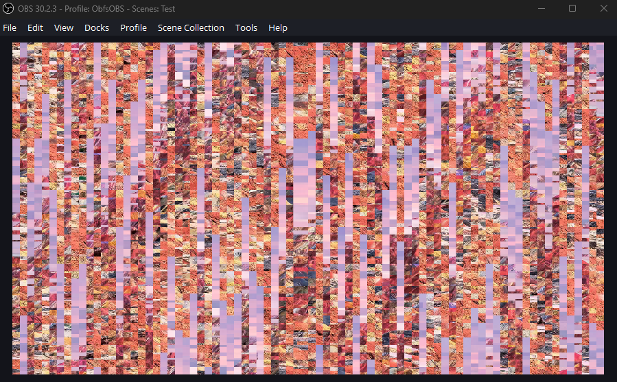

# ObfsOBS

ObfsOBS is a pair of filters designed to obfuscate and de-obfuscate images output by OBS Studio.



## Install

### OBS Studio

1. Download the scripts (*.lua, *.effect.hlsl) and save it into dir `obfsobs` on your computer.
2. Open OBS Studio.
3. Go to Tools, then select Scripts in dir `obfsobs`.

### Daum PotPlayer

1. Download the *.txt files from the player/PotPlayer directory.  
2. Open and edit the filter you want to use (e.g., ReorderX.txt). Modify the following variables and save:  
```hlsl
#define random_seed 42 // Keep this consistent with ShuffleX or Grid Shuffle X-Axis
#define grid_size 40 // Keep this consistent with the above
```
3. Copy these txt files to the PxShader directory within your PotPlayer installation directory.
4. Restart PotPlayer.

## Apply filter

## Obfuscate

### OBS Studio

#### Step 1: Adding Filters
1. **Locate the "Add" button:** Look for a button labeled "Add" or something similar. It's usually found near the list of available filters.
2. **Click "Add":** Once you find the "Add" button, click on it. This will open a dialog box or menu where you can select the filters you want to use.
3. **Choose the filters:** From the list of available filters, select the following:
   * **Grid Shuffle X-Axis:** This filter shuffles the image along the horizontal axis.
   * **Grid Shuffle Y-Axis:** This filter shuffles the image along the vertical axis.

#### Step 2: Arranging Filters
1. **Filter order:** The order in which you apply these filters can affect the final result. For the best obfuscation, it's recommended to apply them in the following order: Grid Shuffle X-Axis, Grid Shuffle Y-Axis, and then Grid Shuffle X-Axis again. This is often referred to as an "X-Y-X" pattern. 
2. **Adjust settings:** Many filters allow you to customize their behavior using settings like "tile size" and "random seed". These settings control how the filter shuffles the image. Experiment with different values for these settings to achieve the desired level of obfuscation.
   * **Tile size:** A smaller tile size generally results in a more chaotic and difficult-to-understand image.
   * **Random seed:** The random seed controls the starting point for the random number generator used by the filter. Changing the random seed will produce a different result.

**Why this order and settings?**
By applying the filters in an "X-Y-X" pattern and adjusting the tile size and random seed, you create a more complex and less recognizable image. This makes it harder for someone to reverse engineer the original image.

### Daum PotPlayer

1. Right-click anywhere on the PotPlayer window.
2. From the context menu, navigate to Video -> Pixel Shader -> Post-Resize Pixel Shaders -> Stack.
3. In the Stack list, locate and check the boxes corresponding to the filters "ShuffleX" and "ShuffleY" in that
   specific order.

## De-obfuscate

### OBS Studio

**Understanding the Difference**

De-obfuscation is the process of reversing the effects of obfuscation. While obfuscation uses filters like `Grid Shuffle X-Axis` and `Grid Shuffle Y-Axis` to scramble an image, de-obfuscation uses `Grid Reorder X-Axis` and `Grid Reorder Y-Axis` to unscramble it.

**Key differences between obfuscation and de-obfuscation:**
* **Filter order:** In obfuscation, a common pattern is X1-Y1-X2-Y2. For de-obfuscation, you'll need to reverse this to Y2-X2-Y1-X1. 
* **Filter types:** While obfuscation uses "Shuffle" filters to scramble, de-obfuscation uses "Reorder" filters to unscramble. 
* **Settings:** Both processes typically use settings like "tile size" and "random seed". To successfully de-obfuscate, ensure that these settings exactly match those used in the obfuscation process.

**Step-by-Step Guide:**

1. **Identify the Obfuscation Sequence:** 
   * Determine the exact order of filters and their settings used during the obfuscation process. For example, if the obfuscation sequence was `Grid Shuffle X-Axis (tile size: 16, seed: 42)`, followed by `Grid Shuffle Y-Axis (tile size: 16, seed: 42)`, and then `Grid Shuffle X-Axis (tile size: 16, seed: 42)`, your de-obfuscation sequence would be the reverse: `Grid Reorder X-Axis (tile size: 16, seed: 42)`, `Grid Reorder Y-Axis (tile size: 16, seed: 42)`, and finally `Grid Reorder X-Axis (tile size: 16, seed: 42)`.

2. **Add the De-Obfuscation Filters:**
   * **Locate the "Add" button:** Just like in the obfuscation process, find the "Add" button to add filters.
   * **Choose the filters:** Select the `Grid Reorder X-Axis` and `Grid Reorder Y-Axis` filters.
   * **Set the parameters:** Ensure that the "tile size" and "random seed" for each filter match exactly those used in the corresponding obfuscation filter.

3. **Arrange the Filters in Reverse Order:**
   * Place the filters in the reverse order of the obfuscation sequence. For example, if the obfuscation sequence was X1-Y1-X2-Y2, arrange the de-obfuscation filters as Y2-X2-Y1-X1.

4. **Apply the Filters:**
   * Apply the filters to the image. The software should now process the image and reverse the effects of the obfuscation.

**Important Notes:**

* **Accuracy of settings:** The accuracy of the "tile size" and "random seed" values is crucial for successful de-obfuscation. Even a slight difference can result in a distorted image.
* **Filter order:** The exact order of the filters is essential. Reversing the order is key to undoing the obfuscation.
* **Multiple passes:** In some cases, you might need to apply the de-obfuscation filters multiple times to fully recover the original image, especially if complex obfuscation techniques were used.

### Daum PotPlayer

1. Right-click anywhere on the PotPlayer window.
2. From the context menu, navigate to Video -> Pixel Shader -> Post-Resize Pixel Shaders -> Stack.
3. In the Stack list, locate and check the boxes corresponding to the filters "ReorderX" and "ReorderY" in that
   specific order.

## TODO
 * [x] Support Daum PotPlayer
 * [ ] Support mpv